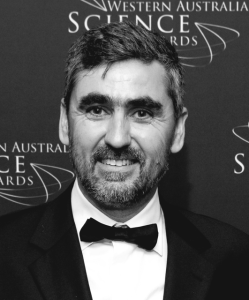
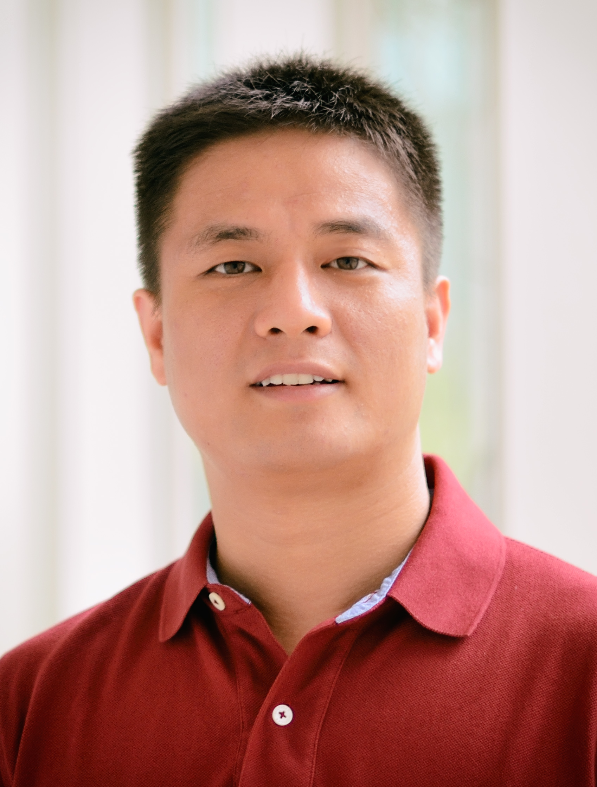
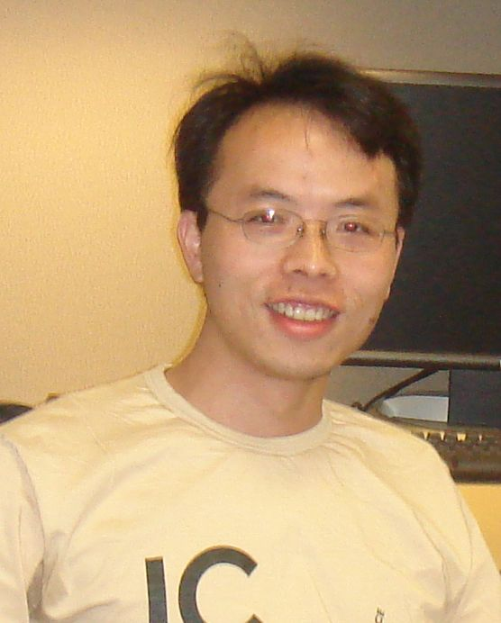

# Overview
In this workshop, we aim to address the trustworthy issues of Multimedia Computing. We aim to bring together researchers in the Trustworthy aspect of Multimedia Computing and facilitate discussions in injecting trusts into multimedia to develop trustworthy techniques that are reliable and acceptable to multimedia researchers and practitioners. Our scope is at the conjunction of multimedia and trustworthy AI, including Explainability, Robustness & Safety, Data Privacy, Accountability & Transparency, and Fairness.

# Speakers

  

     
    <a href="https://www.ceessnoek.info/">Cees Snoek</a> 
    University of Amsterdam
  

  
  

  

  
  

     
  <a href="https://web.eecs.umich.edu/~kuipers/">Benjamin Kuipers</a> 
    University of Michigan
  

  
  

  

  
  

     
  <a href="https://aisecure.github.io/">Bo Li</a> 
    UIUC
  

  
  

  

  
  

     
    <a href="https://ajmalsaeed.net/">Ajmal Mian</a> 
    University of Western Australia
  

  

     
    <a href="http://tingyao.deepfun.club/">Ting Yao</a> 
    JD.com
  

  
  

  

  
  

     
  <a href="https://www.yf.io/">Fisher Yu</a> 
    ETH Zurich
  

## Call for Contributions
We believe the workshop will offer a timely collection of research updates to benefit the people working in the broad fields ranging from multimedia, computer vision to machine learning. To this end, we solicit original research and survey papers addressing the topics listed below (but not limited to):
- Interpretable AI methods for Multimedia Computing
- Robustness of Multimedia Computing
- Security/safety and privacy in Multimedia processing
- Fairness and ethics in Multimedia Computing
- Datasets and evaluation metrics for Trustworthy Multimedia computing
- Theories of interpretable Multimedia models
- Visualization for Multimedia Computing models
- Causality reasoning and learning in Multimedia Computing
- Applications of trustworthy AI for Multimedia, e.g. in medical diagnosis, autonomous driving, defense applications

## Important dates
- Paper submission: July 30th, 2021
- Author Notification: August 26th, 2021
- Camera-Ready: September 2nd, 2021
- Workshop: October XX, 2021

All deadlines are at midnight(23:59) anywhere on Earth.

## Instructions
We use the same formatting template as ACM Multimedia 2021. Submissions can be of varying length from 4 to 8 pages, plus additional pages for the reference pages. There is no distinction between long and short papers. All papers will undergo the same review process and review period. All contributions must be submitted through CMT:

Use the following link: [https://cmt3.research.microsoft.com/ACMMM2021/](https://cmt3.research.microsoft.com/ACMMM2021/)
Select the track: “1st International Workshop on Trustworthy AI for Multimedia Computing”
The accepted workshop papers will be published in the ACM Digital Library.

## Schedule

| Time | Event |
| ----- | -------|
| 9:00 | Opening remarks |
| 9:10 | Invited talk 1 |
| 9:45 | Invited talk 2 |
| 10:20 | Invited talk 3 |
| 10:55 | Invited talk 4 |
| 11:30 | Invited talk 5 |
| 12:05 | Lunch break |
| 14:00 | Invited talk 6 |
| 14:30 | Oral 1 |
| 15:00 | Oral 2 |
| 15:30 | Oral 3 |
| 15:45 | Poster Session and tea break |

## Organizers

  

     
    <a href="http://people.rennes.inria.fr/Teddy.Furon/website/Welcome.html">Teddy Furon</a> 
    INRIA
  

  
  

  

  
  

     
  <a href="http://www.cs.ucf.edu/~liujg/">Jingen Liu</a> 
    JD.com 
  

 
  
  

  

  
  

     
  <a href="https://www.crcv.ucf.edu/person/rawat/">Yogesh Rawat</a> 
    University of Central Florida
  

  

     
    <a href="http://wzhang.fun/">Wei Zhang</a> 
    JD.com
  

  
  

  

  
  

     
  <a href="https://www-users.cs.umn.edu/~qzhao/index.html">Qi Zhao</a> 
    Microsoft Research
  

## Program Committee

| --- | --- |
| Ping Liu | Sr. Research Scientist, A*STAR, Singapore |
| Naveed Akhtar | Assistant Professor, University of Western Australia, Australia |
| Zheng Sou | Research Scientist, Facebook AI, USA |
| Jian Liu | JD.com Silicon Valley Research Labs, USA |
| Ziyan Wu | Principal Scientist, United Imaging Intelligence, USA |
| Fisher Yu | Assistant Professor, ETH Zürich |
| Huazhu Fu | Senior Scientist, IIAI, United Arab Emirates |
| Yingwei Pan | Research Scientist, JD AI Research, China |
| Yalong Bai | Research Scientist, JD AI Research, China |
| Rahul Ambati | PhD Student, University of Central Florida |
| Aayush Rana | PhD Student, University of Central Florida |
